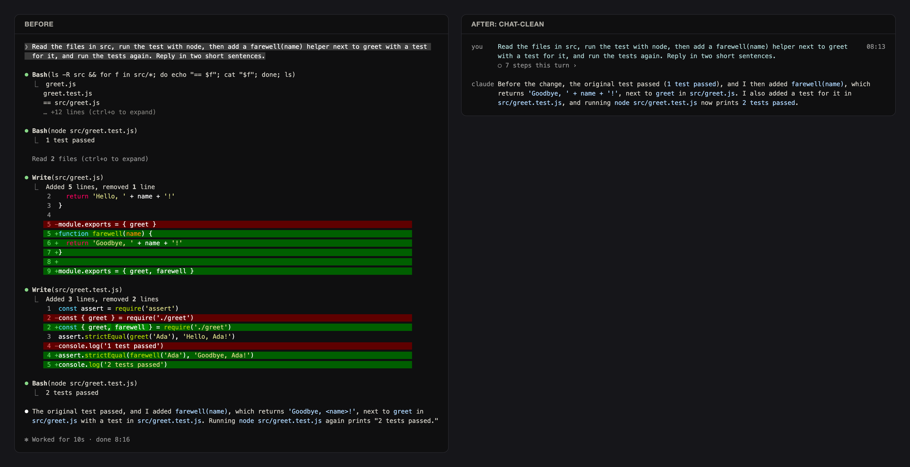

# chat-clean

Read your Claude Code chat like a chat: your messages and Claude's replies stay, the tool calls fold away.

## What it does

- Puts a quiet name column on the left: `you` beside your messages, `claude` beside the replies.
- Shows the time of each of your messages at the right edge.
- Folds every tool call of a turn into one line: `○ 7 steps this turn ›`. The arrow opens it in place.
- Shows a working line while Claude works: a spinner, the step in plain words, and the time.
- Shows a line above the input while a background run goes on after the turn: `Running in the background · Build the docs · 2m · you can keep typing`. A run that looks like a test reads `Test running`.
- Turns each answered question into one line: `? Which colour → Red`.
- Turns an API error into one plain line in the name column, for example `! Connection lost · check your internet · send again to retry`. It is amber when Claude Code handles it, red when you must act.
- Draws a slash command's answer as one quiet line under the command.
- Gives each helper (subagent) its own line with its state and time. `/helpers` opens a pane with each helper's steps.
- Folds messages from other sessions and helpers to one line each.
- Labels never show a raw command, a path or an id. A step reads `Reading app.py` or `Ran 3 shell commands`.

## Install

You need Claude Code 2.1.289 or newer.

1. Copy this folder into your project as `<project>/.claude/skills/chat-clean/`.
2. Start Claude Code in that project. The mod loads by itself.
3. Type `/feed` to see the settings.

To try it without copying, start Claude Code with `claude --plugin-dir /path/to/chat-clean`.

## The three views

| View | What you see |
|---|---|
| `clean` (default) | Your messages, Claude's replies, and one line per turn for the work. |
| `normal` | Each run of tool calls is one line with counts, for example `Ran 3 shell commands · read 1 file`. Nothing is cleared. |
| `raw` | Claude Code's own drawing. The mod draws nothing. |

- `/feed clean`, `/feed normal` or `/feed raw` switches the view. It works while Claude runs.
- `/feed` opens the settings page. Each setting has its own command, for example `/feed group off` or `/feed style line`.
- `/feed hide <kind>` and `/feed show <kind>` switch one kind of row off or on. The kinds are `you`, `said`, `tool`, `agent`, `question`, `peer`, `helper` and `search`.
- ctrl+o still shows the full transcript.
- The view you pick is kept for your next sessions.

## What it cannot hide

Some rows belong to Claude Code itself. No mod can reach them:

- hook rows, for example "Ran 2 stop hooks" or a hook error;
- the reload line that appears when a mod reloads;
- the attachment lines under a message, for example "Read file" or "Loaded CLAUDE.md".

Rows drawn while the mod reloads keep Claude Code's look, because they are already on screen.

## Desktop app

- The desktop app keeps its own message look. The name column is for the terminal only.
- The desktop app runs no status line. The mod uses the band above the input for that:
  - one pill with how much of your 5-hour and weekly limits you have used;
  - while something runs, one pill per running helper, background job and test.

## Contribute

Issues and pull requests are welcome. Read [CONTRIBUTING.md](CONTRIBUTING.md) first.

## Licence

MIT. See [LICENSE](LICENSE).
